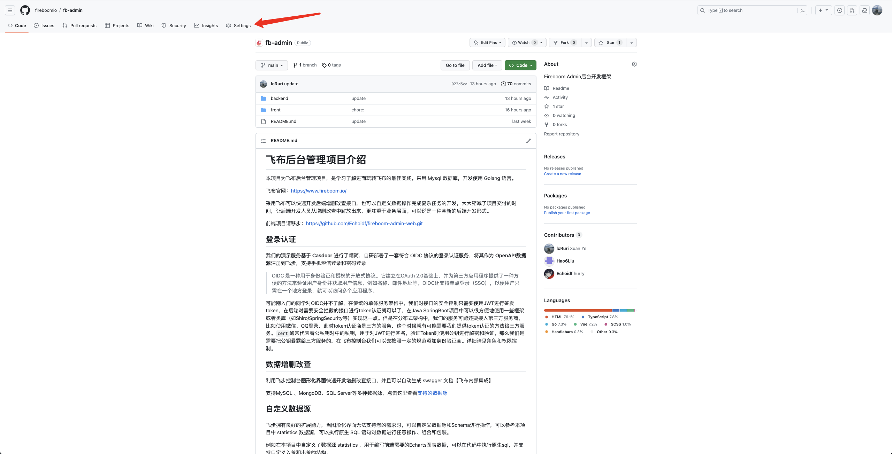
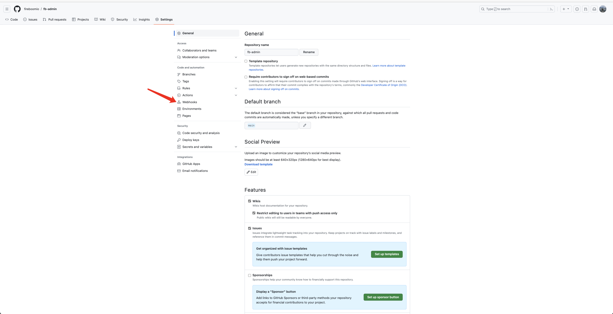
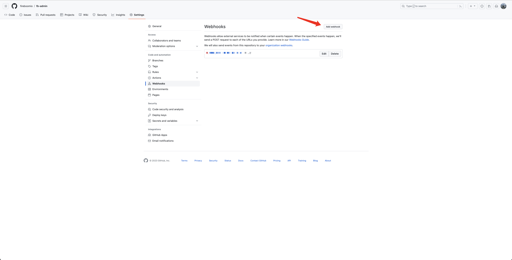
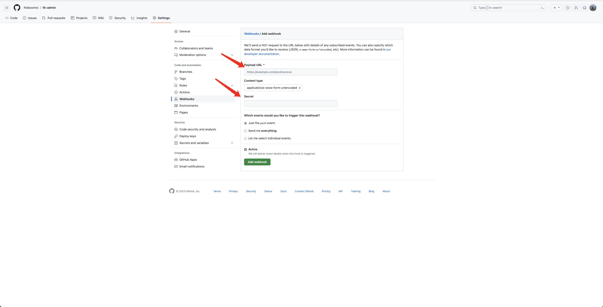
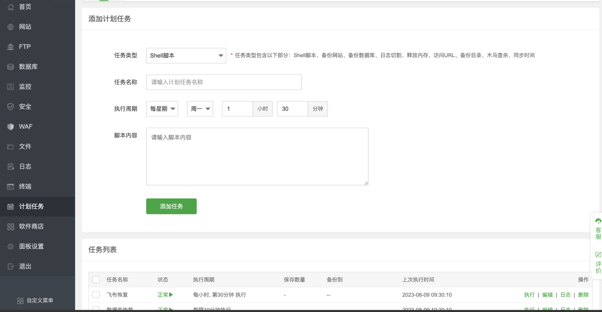

# **Github** **Webhook自动化部署**

1.将fb-admin拉取到自己的Github仓库里面

2.在仓库主界面点击Settings,进入设置界面后点击Webhooks





3.选择Add webhook



4.在Payload URL里面填写接受Github Webhooks请求的地址，同时配置Secret。Github会通过Secret生成密钥，同时将密钥以环境变量的方式存储到服务器中。当服务器收到请求之后，会将将密钥和Github发起请求中的payload一起进行加密得到hash值，和请求中的hash值进行比对校验。

参考文档：[关于 web 挂钩 - GitHub 文档](https://docs.github.com/zh/webhooks-and-events/webhooks/about-webhooks)



5.服务器上面接受请求的代码，以golang为例。

这段代码会监听你在Github填写的Payload URL，收到请求之后进行校验，校验通过之后会执行sh脚本进行更新部署。

```Go
package main

import (
   "crypto/hmac"
   "crypto/sha256"
   "encoding/hex"
   "fmt"
   "io"
   "log"
   "net/http"
   "os"
   "os/exec"
)

func main() {

   http.HandleFunc("/请求的地址", WebHook)
   fmt.Println("listening...")
   err := http.ListenAndServe(":端口", nil)
   if err != nil {
      log.Fatal("ListenAndServe:", err)
   }
}

func WebHook(w http.ResponseWriter, r *http.Request) {
   //密钥
   SECRET_TOKEN, ok := os.LookupEnv("SECRET_TOKEN")
   if !ok {
      log.Fatalln("Token variable is not defined")
   }
   signature := r.Header.Get("x-hub-signature-256")
   fmt.Println(signature)
   body, err := io.ReadAll(r.Body)
   if err != nil {
      fmt.Println(err)
      return
   }

   ok, err = verifySignature(string(body), SECRET_TOKEN, signature)
   if err != nil {
      fmt.Println(err)
      return
   }

   if ok {
      cmd := exec.Command("bash", "update.sh")

      cmd.Dir = "/home/webhook/"

      cmd.Stdout = os.Stdout
      cmd.Stderr = os.Stderr

      err = cmd.Run()
      if err != nil {
         log.Fatalf("Run failed: %v", err)
      }

      fmt.Println("finished!")
      fmt.Fprint(w, "receive from github update admin,update success!")
   }

}

func verifySignature(payloadBody, secretToken, signatureHeader string) (bool, error) {
   if signatureHeader == "" {
      return false, fmt.Errorf("x-hub-signature-256 header is missing!")
   }

   key := []byte(secretToken)
   h := hmac.New(sha256.New, key)
   h.Write([]byte(payloadBody))
   expectedSignature := "sha256=" + hex.EncodeToString(h.Sum(nil))
   fmt.Println("expectedSignature:", expectedSignature)

   if !secureCompare(signatureHeader, expectedSignature) {
      return false, fmt.Errorf("Request signatures didn't match!")
   }

   return true, nil
}

func secureCompare(a, b string) bool {
   if len(a) != len(b) {
      return false
   }

   for i := 0; i < len(a); i++ {
      if a[i] != b[i] {
         return false
      }
   }

   return true
}
```

update.sh脚本，只针对后端部分

```Go
#!/bin/bash
cd /home/fb-admin

git reset --hard HEAD 
git pull -f origin main

#存放项目的目录
cd /home/fb-admin/backend/custom-go
go mod tidy
go build

cd /home/fb-admin/backend/
sh update.sh

systemctl restart fb_custom
systemctl restart fb
systemctl status fb
systemctl status fb_custom
```

# 数据库定时备份

Docker 启动MySQL

挂载目录

/home/mysql/data

/home/mysql/conf

/home/mysql/logs

容器启动

```Go
docker run -p 3308:3306 \
--privileged=true --name mysql \
-v /home/mysql/conf:/etc/mysql/conf.d \
-v /home/mysql/logs:/var/log/mysql  \
-v /home/mysql/data:/var/lib/mysql \
-e MYSQL_ROOT_PASSWORD=123456 -d 
mysql:8.0
```

在/home/mysql下面再建立一个backup文件夹，用来备份数据库的数据，mysql-admin是容器名称，--databases main表示选择备份main数据库。备份生成的和原来的好像有不同。

```Go
docker exec -it mysql-admin /bin/bash -c \
'mysqldump -uroot -p123456 --databases main' > \
/home/mysql/backup/fbadmin_`date +%F`.sql;
```

# 数据库恢复

如果需要恢复初始的数据库，可以在建好数据库之后备份一份sql文件，将sql文件移动到挂载的目录下，这里我放到的是/home/mysql/data目录下面，这样就可以直接在linux上面执行如下命令。

```Go
sudo docker exec mysql-admin sh -c \
'exec mysql -uroot -p1qaz2wsx < /var/lib/mysql/main.sql'
```


# 定时任务

这里使用了宝塔的计划任务



可以将上面的update.sh脚本和数据库恢复脚本的内容填入即可。

当然也可以使用linux自带的corntab实现。
