# Docker部署

## 1.访问https://dashboard.render.com/

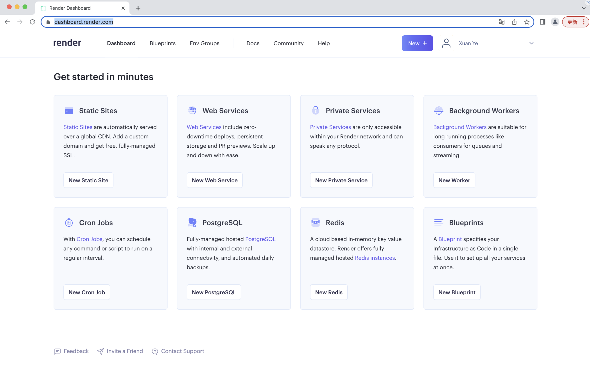

## 2.点击Web Service

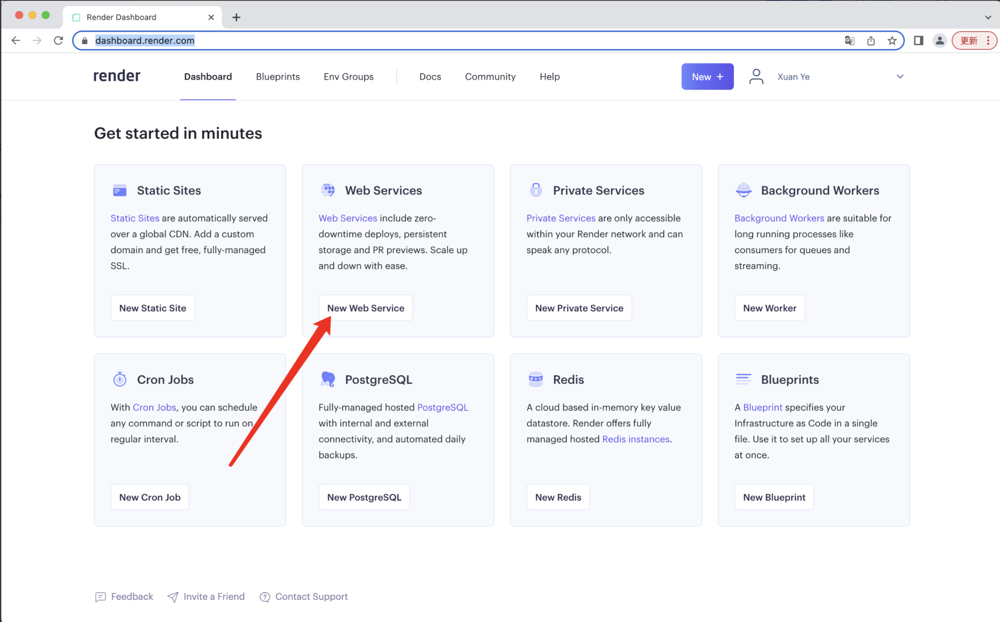

## 3.填写如下地址

https://github.com/lcRuri/fireboom-docker

点击continue

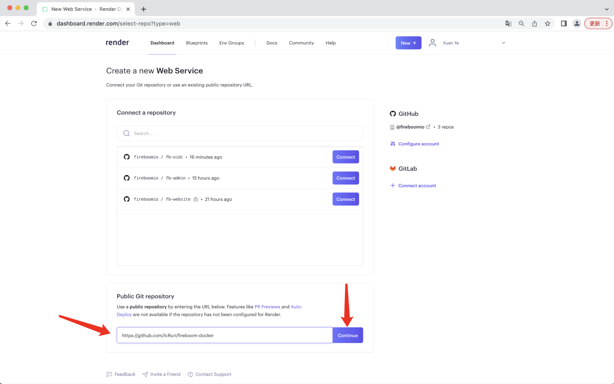

## 4.填写名称，创建web服务

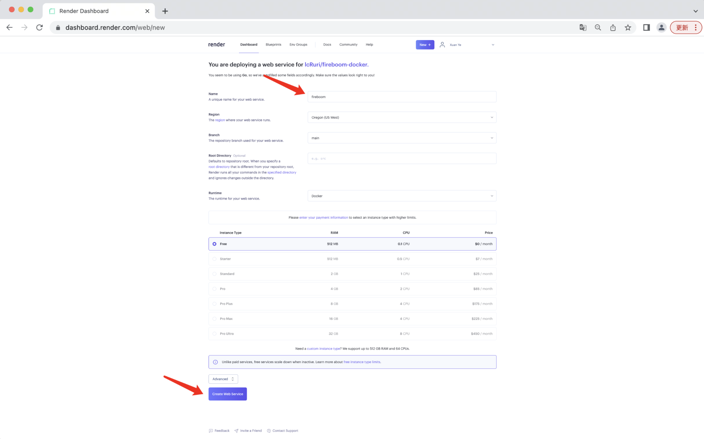

## 5.等待安装，然后访问

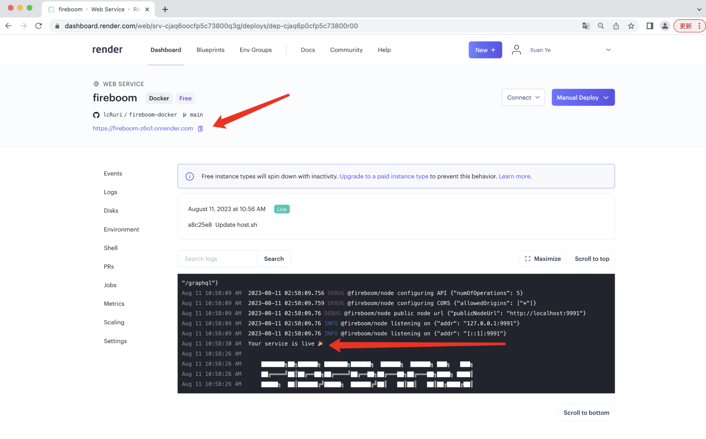

## 6.访问

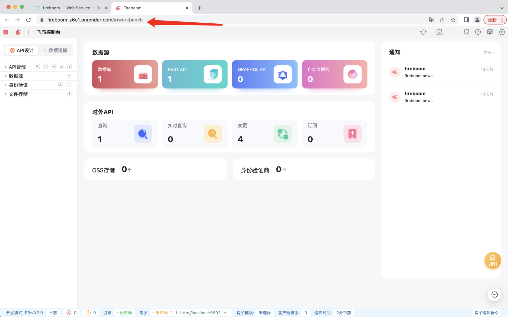

# 仓库部署

## 1.填写github仓库地址

可以从replit提交代码，render进行部署

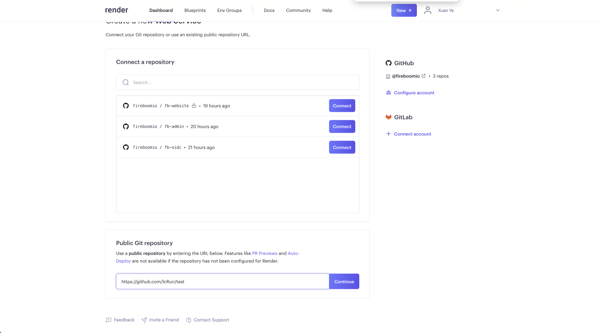

## 2.配置

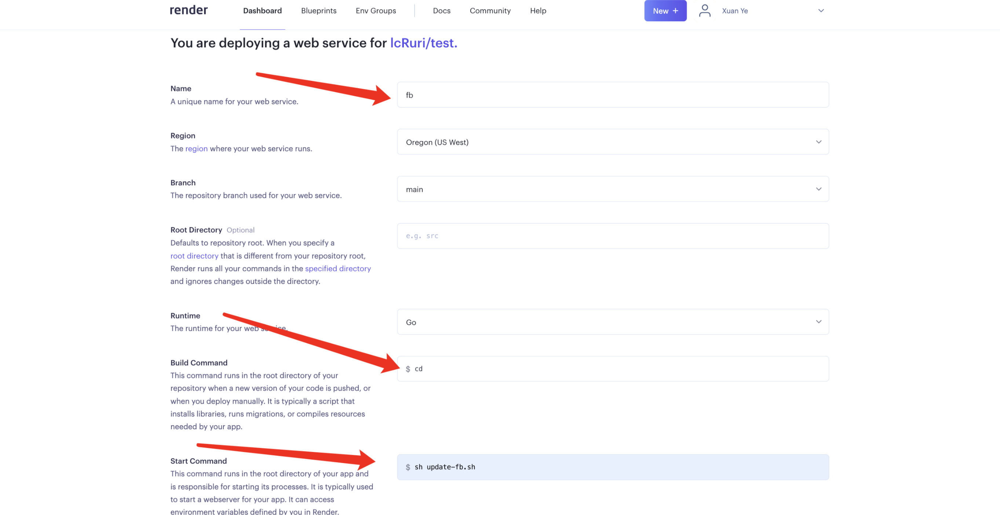

环境变量改变端口

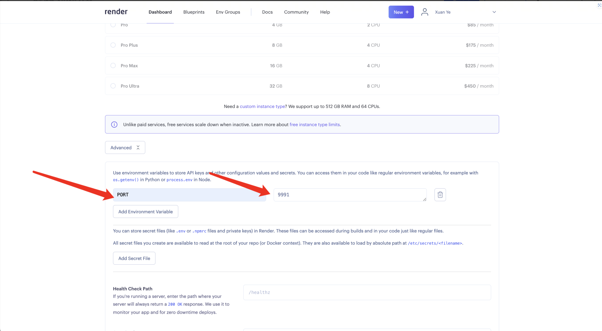

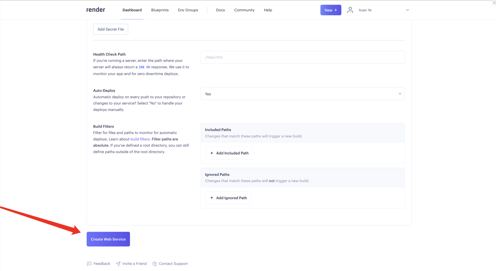

## 3.访问

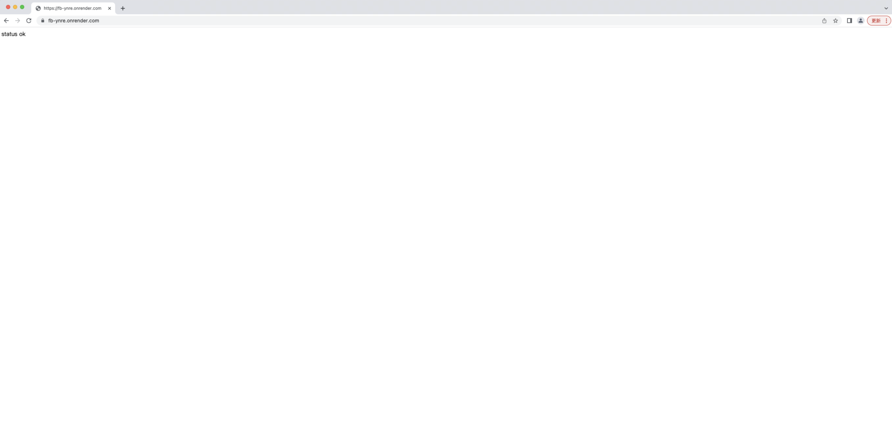