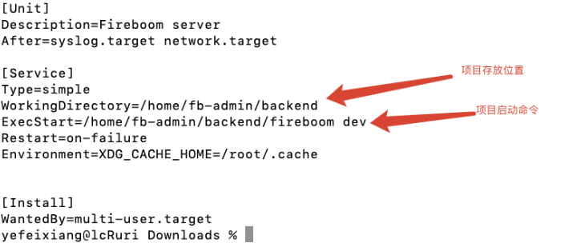
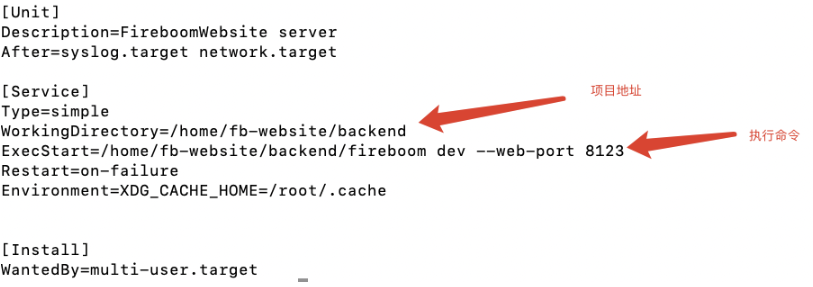

# admin项目重启

请将以下文件放到/lib/systemd/system目录下面

casdoor.service fb.service fb_custom.service



飞布、custom 、casdoor重启命令

```Go
重启fb命令
systemctl restart fb

停止fb命令
systemctl stop fb

查看fb状态
systemctl status fb
重启fb_custom命令
systemctl restart fb_custom

停止fb_custom命令
systemctl stop fb_custom

查看fb_custom状态
systemctl status fb_custom
重启casdoor命令
systemctl restart casdoor

停止casdoor命令
systemctl stop casdoor

查看casdoor状态
systemctl status casdoor
```

# admin项目更新

项目地址：https://github.com/fireboomio/fb-admin

更新：

```Go
1.拉取代码 
git pull origin main

2.下载飞布二进制
sh update-fb.sh

3.构建custom-go的二进制
cd backend/custom-go
go mod tidy && go build

4.重启 
systemctl restart fb
systemctl restart fb_custom
```

# website重启

请将以下文件放到/lib/systemd/system目录下面

website.service website_custom.service



```Go
重启website命令
systemctl restart website

停止website命令
systemctl stop website

查看website状态
systemctl status website
重启website_custom命令
systemctl restart website_custom

停止website_custom命令
systemctl stop website_custom

查看website_custom状态
systemctl status website_custom
```


# website项目更新

项目地址：https://github.com/fireboomio/fb-website

更新：

```Go
1.拉取代码 
git pull origin main

2.下载飞布二进制
sh update-fb.sh

3.构建custom-go的二进制
cd backend/custom-go
go mod tidy && go build

4.重启 
systemctl restart website
systemctl restart website_custom
```